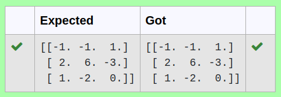

# INVERSE-OF-A-MATRIX
## Aim:
To write a python program to find the inverse of a matrix
## Equipment’s required:
1. 	Hardware – PCs
2. 	Anaconda – Python 3.7 Installation / Moodle-Code Runner
## Algorithm:
### Step1 : 
Import math function as np
### Step 2: 
Get array input from User
### Step 3: 
By np.linalg.inv(), we can find the rank of the given matrix.
### Step 4: 
Print the program
## Program:
```
#Program to find the inverse of a matrix.
#Developed by: Thirukaalathessvarar S
#RegisterNumber: 22004529

import numpy as np
a=np.array([[6,2,3],[3,1,1],[10,3,4]])
result=np.linalg.inv(a)
print(result)
```

## Output:

## Result:
Thus the inverse of given matrix is successfully solved using python program

